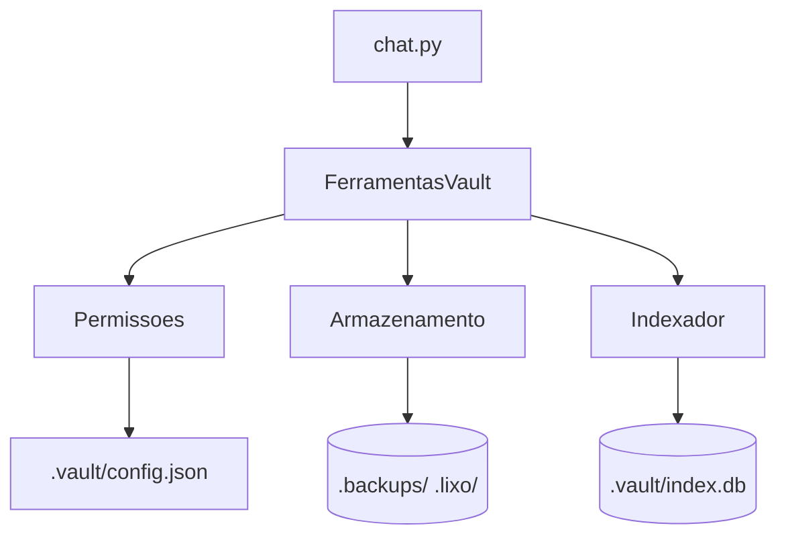

# MNEMO — Vault Pessoal com IA

Plataforma local-first para notas Markdown com pesquisa semântica e assistente conversacional (Nemotron/NVIDIA).

## Arquitetura (Fase 1)



## Estrutura do Projeto

```
MNEMO/
├── mnemo/              # pacote Python
│   ├── __init__.py
│   ├── permissoes.py
│   ├── armazenamento.py
│   ├── indexador.py
│   ├── ferramentas.py
│   └── modelo_nvidia.py
├── tests/              # 35 testes pytest
├── vault-teste/        # vault de demonstração (commit-safe)
├── chat.py             # CLI interativo
├── .env.example        # template de variáveis
└── .gitignore
```

## Instalação

```bash
git clone https://github.com/Leonardoglitch/MNEMO.git
cd MNEMO
# Python 3.9+, sem dependências externas obrigatórias
```

## Configuração

```bash
cp .env.example .env
# edite .env e insira sua chave:
# NVIDIA_API_KEY=nvapi-...
# Opcional: escolha o modelo (padrão: nvidia/nemotron-3-super-120b-a12b)
# NVIDIA_MODEL=nvidia/nemotron-3-ultra
```

## Testes

```bash
python -m pytest tests/ -v
# 38 testes: permissões, índice, modelo NVIDIA, chat, ferramentas
```

## Uso Rápido

```bash
# Indexar vault de teste
python -c "from mnemo import Permissoes, Indexador; i=Indexador(Permissoes('vault-teste')); print(i.reindexar_tudo())"

# Chat interativo (modelo padrão)
python chat.py --vault vault-teste

# Chat com modelo específico via CLI
python chat.py --vault vault-teste --modelo nvidia/nemotron-3-ultra

# Ou defina NVIDIA_MODEL no .env e use apenas:
python chat.py --vault vault-teste
```

### Trocar modelo durante a conversa

No REPL, use o comando:
```
/modelo nvidia/nemotron-3-ultra
```

Modelos disponíveis na NVIDIA:
- `nvidia/nemotron-3-ultra` — maior, mais capaz
- `nvidia/nemotron-3-super-120b-a12b` — **padrão**, equilíbrio custo/qualidade
- `nvidia/nemotron-4-340b-instruct` — novo, bom para tool-calling
- `nvidia/llama-3.1-nemotron-70b-instruct` — pesos abertos

Outros comandos REPL:
- `/ajuda` — lista comandos
- `sair` / `exit` / `quit` — termina

## Componentes Principais

| Módulo | Responsabilidade |
|--------|------------------|
| `permissoes.py` | Whitelist de pastas, bloqueio de path traversal |
| `armazenamento.py` | CRUD atómico + backups + lixo (.lixo/) |
| `indexador.py` | SQLite FTS5, prefixo + remove_diacritics |
| `ferramentas.py` | search, read_note, create_note, append_to_note |
| `modelo_nvidia.py` | Cliente HTTP OpenAI-compatível p/ Nemotron |
| `chat.py` | Loop tool-calling com histórico de mensagens |

## Convenções Git

- `git add -A` (apanha dotfiles)
- Commits atómicos, mensagens imperativas ("feat:", "fix:", "docs:")
- Sem `commit --amend` no histórico partilhado
- Branch `main` protegida; PRs para revisão