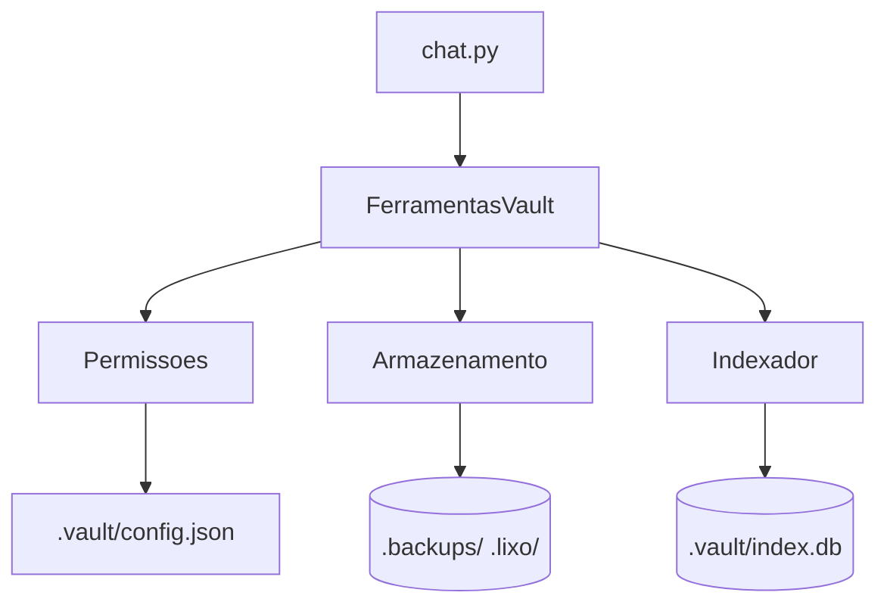

# MNEMO — Vault Pessoal com IA

Plataforma local-first para notas Markdown com pesquisa semântica e assistente conversacional (Nemotron/NVIDIA).

## Arquitetura (Fase 1)



## Estrutura do Projeto

```
MNEMO/
├── mnemo/              # pacote Python
│   ├── __init__.py
│   ├── permissoes.py
│   ├── armazenamento.py
│   ├── indexador.py
│   ├── ferramentas.py
│   └── modelo_nvidia.py
├── tests/              # 44 testes pytest
├── vault-teste/        # vault de demonstração (commit-safe)
├── chat.py             # CLI interativo
├── chat_ui.py          # UI (rich + prompt_toolkit)
├── config.py           # Config persistente (~/.mnemo/config.json)
├── pyproject.toml      # dependências (rich, prompt_toolkit)
├── .env.example        # template de variáveis
└── .gitignore
```

## Instalação

```bash
git clone https://github.com/Leonardoglitch/MNEMO.git
cd MNEMO
pip install -e .          # instala dependências (rich, prompt_toolkit)
# Python 3.9+
```

## Configuração

```bash
cp .env.example .env
# edite .env e insira sua chave:
# NVIDIA_API_KEY=nvapi-...
# Opcional: escolha o modelo (padrão: nvidia/nemotron-3-super-120b-a12b)
# NVIDIA_MODEL=nvidia/nemotron-3-ultra
```

A configuração persistente fica em `~/.mnemo/config.json` (criado automaticamente).
Pode definir vault/modelo/tema padrão via CLI e gravar com `--save-config`.

## Testes

```bash
python -m pytest tests/ -v
# 44 testes: permissões, índice, modelo NVIDIA, chat, ferramentas, UI, config
```

## Uso Rápido

```bash
# Indexar vault de teste
python -c "from mnemo import Permissoes, Indexador; i=Indexador(Permissoes('vault-teste')); print(i.reindexar_tudo())"

# Chat interativo (modelo padrão)
python chat.py --vault vault-teste

# Chat com modelo específico via CLI
python chat.py --vault vault-teste --modelo nvidia/nemotron-3-ultra

# Definir vault/modelo padrão e gravar config
python chat.py --vault vault-teste --modelo nvidia/nemotron-3-ultra --save-config

# A partir daí basta:
python chat.py
```

### Comandos REPL

| Comando | Descrição |
|---------|-----------|
| `/salvar` | Grava checkpoint da conversa em `historico/YYYY-MM-DD_HH-MM.md` |
| `/historico` | Lista últimos 10 registos em `historico/` com preview |
| `/vault` | Mostra vault atual |
| `/vault <path>` | Indica como trocar vault (reiniciar com `--vault`) |
| `/modelo <id>` | Troca modelo NVIDIA (ex.: `/modelo nvidia/nemotron-3-ultra`) |
| `/limpar` | Limpa ecrã e reimprime boas-vindas |
| `/config` | Mostra configuração atual |
| `/config theme dark|light|auto` | Altera tema de cores (persiste) |
| `/ajuda` / `/help` | Lista comandos |
| `sair` / `exit` / `quit` | Termina a conversa (auto-save) |

### Modelos disponíveis na NVIDIA

- `nvidia/nemotron-3-ultra` — maior, mais capaz
- `nvidia/nemotron-3-super-120b-a12b` — **padrão**, equilíbrio custo/qualidade
- `nvidia/nemotron-4-340b-instruct` — novo, bom para tool-calling
- `nvidia/llama-3.1-nemotron-70b-instruct` — pesos abertos

### Temas de cores

- `auto` (padrão) — detecta terminal escuro/claro
- `dark` — fundo escuro
- `light` — fundo claro

Definir via CLI: `python chat.py --theme dark` ou no REPL: `/config theme dark`.

## Componentes Principais

| Módulo | Responsabilidade |
|--------|------------------|
| `permissoes.py` | Whitelist de pastas, bloqueio de path traversal |
| `armazenamento.py` | CRUD atómico + backups + lixo (.lixo/) |
| `indexador.py` | SQLite FTS5, prefixo + remove_diacritics |
| `ferramentas.py` | search, read_note, create_note, append_to_note |
| `modelo_nvidia.py` | Cliente HTTP OpenAI-compatível p/ Nemotron |
| `chat.py` | Loop tool-calling com histórico de mensagens |
| `chat_ui.py` | UI rich + prompt_toolkit (cores, spinners, histórico navegável, autocomplete) |
| `config.py` | Configuração persistente `~/.mnemo/config.json` |

## Convenções Git

- `git add -A` (apanha dotfiles)
- Commits atómicos, mensagens imperativas ("feat:", "fix:", "docs:")
- Sem `commit --amend` no histórico partilhado
- Branch `main` protegida; PRs para revisão