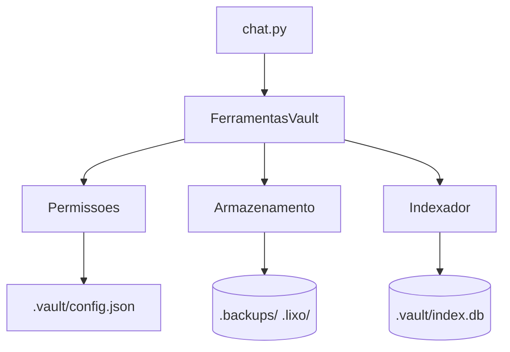

# MNEMO — Vault Pessoal com IA

Plataforma local-first para notas Markdown com pesquisa semântica e assistente conversacional (Nemotron/NVIDIA).


## Arquitetura (Fase 1)


```mermaid
graph TD
    A[chat.py] --> B[FerramentasVault]
    B --> C[Permissoes]
    B --> D[Armazenamento]
    B --> E[Indexador]
    D --> F[(.backups/ .lixo/)]
    E --> G[(.vault/index.db)]
    C --> H[.vault/config.json]
```

## Estrutura do Projeto

```
MNEMO/
├── mnemo/              # pacote Python
│   ├── __init__.py
│   ├── permissoes.py
│   ├── armazenamento.py
│   ├── indexador.py
│   ├── ferramentas.py
│   └── modelo_nvidia.py
├── tests/              # 56 testes pytest
├── vault-teste/        # vault de demonstração (commit-safe)
├── chat.py             # CLI interativo
├── chat_ui.py          # UI (rich + prompt_toolkit)
├── config.py           # Config persistente (~/.mnemo/config.json)
├── pyproject.toml      # dependências (rich, prompt_toolkit)
├── .env.example        # template de variáveis
└── .gitignore
```

## Instalação

```bash
git clone https://github.com/Leonardoglitch/MNEMO.git
cd MNEMO
pip install -e .          # instala dependências (rich, prompt_toolkit)
# Python 3.9+
```

## Configuração

```bash
cp .env.example .env
# edite .env e insira sua chave:
# NVIDIA_API_KEY=nvapi-...
# Opcional: escolha o modelo (padrão: nvidia/nemotron-3-super-120b-a12b)
# NVIDIA_MODEL=nvidia/nemotron-3-ultra
```

A configuração persistente fica em `~/.mnemo/config.json` (criado automaticamente).
Pode definir vault/modelo/tema padrão via CLI e gravar com `--save-config`.

## Inicializando um Vault

### Opção 1: Vault de Demonstração (rápido)
```bash
# Usa o vault-teste/ já incluído no repo
python chat.py --vault vault-teste
```

### Opção 2: Criar Vault Novo (recomendado)
```bash
# 1. Cria estrutura completa em ~/meu-vault
python -c "
from mnemo import Permissoes, Armazenamento, Indexador
from pathlib import Path

vault = Path('~/meu-vault').expanduser()
vault.mkdir(parents=True, exist_ok=True)

# Configuração do vault
config = {
    'versao': 1,
    'todas_as_pastas': False,
    'pastas_permitidas': ['projetos', 'estudo', 'pessoal', 'historico']
}
(vault / '.vault').mkdir(exist_ok=True)
(vault / '.vault' / 'config.json').write_text(
    __import__('json').dumps(config, indent=2), encoding='utf-8'
)

# Cria pastas de notas
for pasta in config['pastas_permitidas']:
    (vault / 'notas' / pasta).mkdir(parents=True, exist_ok=True)

# Inicializa índice
perms = Permissoes(str(vault))
idx = Indexador(perms)
print('Indexados:', idx.reindexar_tudo(), 'arquivos')
print('Vault criado em:', vault)
"

# 2. Inicia o chat
python chat.py --vault ~/meu-vault
```

### Opção 3: Vault Mínimo (manual)
```bash
mkdir -p ~/meu-vault/notas/projetos
mkdir -p ~/meu-vault/.vault

cat > ~/meu-vault/.vault/config.json << 'EOF'
{
  "versao": 1,
  "todas_as_pastas": false,
  "pastas_permitidas": ["projetos", "historico"]
}
EOF

python chat.py --vault ~/meu-vault
```

### Estrutura Criada
```
meu-vault/
├── .vault/
│   ├── config.json          # config do vault (pastas permitidas)
│   └── index.db             # SQLite FTS5 (criado ao indexar)
├── notas/
│   ├── projetos/            # pasta permitida
│   ├── estudo/              # pasta permitida
│   ├── pessoal/             # pasta permitida
│   └── historico/           # pasta permitida (checkpoints /salvar)
└── .backups/                # backups automáticos (criado ao escrever)
    └── projetos/
└── .lixo/                   # lixeira (criado ao apagar)
    └── projetos/
```

### Salvando Configuração como Padrão
```bash
# Após criar o vault, define como padrão
python chat.py --vault ~/meu-vault --save-config

# Da próxima vez, basta:
python chat.py
```

## Testes

```bash
python -m pytest tests/ -v
# 85 testes: permissões, índice, modelo NVIDIA, chat, ferramentas, UI, config, histórico
```

## Desenvolvimento

### Type Checking (mypy)

```bash
# Módulos core (mnemo/, config.py) — strict mode passa
python -m mypy --strict mnemo/ config.py

# Projeto completo — 37 erros residuais em código TUI/HTTP dinâmico (não bloqueantes)
python -m mypy --strict mnemo/ chat.py chat_ui.py config.py
```

**Erros conhecidos (falsos positivos):**
- `mnemo/modelo_nvidia.py` (6): `urllib.request` sem stubs completos
- `chat_ui.py` (24): `prompt_toolkit` API dinâmica (closures, decorators)
- `chat.py` (7): Union types no loop de ferramentas (refinamento manual)

Todos os 85 testes passam — o código funciona corretamente.

### Estrutura de Testes

```
tests/
├── test_permissoes.py       # Whitelist, path traversal
├── test_armazenamento.py    # CRUD, backups, lixo
├── test_indexador.py        # FTS5, reindexação, diacríticos
├── test_ferramentas.py      # 5 ferramentas do agente
├── test_modelo_nvidia.py    # Cliente HTTP, streaming
├── test_chat.py             # Loop tool-calling, comandos
├── test_chat_ui.py          # UI, formatação, TUI histórico
├── test_config.py           # Config persistente, validação
└── test_historico.py        # Histórico: TUI, busca, filtros, export/import, autocomplete
```

### Convenções de Código

- **Type hints**: Obrigatórios em módulos core (`mnemo/`, `config.py`)
- **Testes**: Um arquivo por módulo, classes `Test<Feature>`, fixtures em `conftest.py` (futuro)
- **Commits**: Imperativos, prefixos `feat:`, `fix:`, `docs:`, `refactor:`, `test:`
- **Formatação**: Black (line-length=100), isort (profile=black)

### Adicionando Nova Ferramenta

1. Implementar em `mnemo/ferramentas.py` (função + schema OpenAI)
2. Registrar em `FerramentasVault.get_tool_definitions()`
3. Adicionar handler em `chat.py` no loop de tool-calling
4. Criar testes em `tests/test_ferramentas.py`
5. Executar `python -m pytest tests/ -v && python -m mypy --strict mnemo/ferramentas.py`

## Uso Rápido

```bash
# Indexar vault de teste
python -c "from mnemo import Permissoes, Indexador; i=Indexador(Permissoes('vault-teste')); print(i.reindexar_tudo())"

# Chat interativo (modelo padrão)
python chat.py --vault vault-teste

# Chat com modelo específico via CLI
python chat.py --vault vault-teste --modelo nvidia/nemotron-3-ultra

# Definir vault/modelo padrão e gravar config
python chat.py --vault vault-teste --modelo nvidia/nemotron-3-ultra --save-config

# A partir daí basta:
python chat.py
```

### Comandos REPL

| Comando | Descrição |
|---------|-----------|
| `/salvar` | Grava checkpoint da conversa em `historico/YYYY-MM-DD_HH-MM.md` |
| `/historico` | **Abre navegador interativo (TUI)** — setas ↑↓, Enter=carregar, q/Esc=sair |
| `/historico --since YYYY-MM-DD --until YYYY-MM-DD --model <id>` | Lista filtrada por data/modelo |
| `/historico search <termo>` | Busca termo no histórico com preview contextual |
| `/historico load <id>` | Carrega sessão anterior e continua conversa |
| `/historico export <arquivo.json> [--since ...] [--until ...] [--model ...]` | Exporta histórico para JSON |
| `/historico import <arquivo.json>` | Importa histórico de JSON (pula duplicados) |
| `/vault` | Mostra vault atual |
| `/vault <path>` | Indica como trocar vault (reiniciar com `--vault`) |
| `/modelo <id>` | Troca modelo NVIDIA (ex.: `/modelo nvidia/nemotron-3-ultra`) |
| `/limpar` | Limpa ecrã e reimprime boas-vindas |
| `/config` | Mostra configuração atual |
| `/config theme dark|light|auto` | Altera tema de cores (persiste) |
| `/ajuda` / `/help` | Lista comandos |
| `sair` / `exit` / `quit` | Termina a conversa (auto-save) |
| `Ctrl+C` | Pergunta confirmação (S/n); 2× Ctrl+C = saída forçada sem salvar |

### Modelos disponíveis na NVIDIA

- `nvidia/nemotron-3-ultra` — maior, mais capaz
- `nvidia/nemotron-3-super-120b-a12b` — **padrão**, equilíbrio custo/qualidade
- `nvidia/nemotron-4-340b-instruct` — novo, bom para tool-calling
- `nvidia/llama-3.1-nemotron-70b-instruct` — pesos abertos

### Temas de cores

- `auto` (padrão) — detecta terminal escuro/claro
- `dark` — fundo escuro
- `light` — fundo claro

Definir via CLI: `python chat.py --theme dark` ou no REPL: `/config theme dark`.

### Saída com Ctrl+C (SIGINT/SIGTERM)

O chat trata sinais de interrupção de forma segura:

| Ação | Comportamento |
|------|---------------|
| **Ctrl+C** (1ª vez) | Pergunta: `Sair e gravar histórico? (S/n)` — Enter/S = salva e sai; `n` = continua |
| **Ctrl+C** (2ª vez rápida) | Saída forçada imediata — **histórico NÃO gravado** |
| `kill <pid>` (SIGTERM) | Mesmo comportamento do 1º Ctrl+C |
| Durante chamada de ferramenta | Termina a ferramenta atual e pergunta confirmação no próximo ciclo |

> **Dica:** Use `sair` / `exit` / `quit` para saída normal com auto-save garantido.

### Histórico Navegável (TUI)

O comando `/historico` sem argumentos abre uma **interface interativa (TUI)** com navegação por setas:

```
┌─────────────────────────────────────────────────────────────┐
│ ▶ 2026-09-27_11-11.md — analisa todas as notas...          │
│   2026-09-27_10-32.md — diz o nome de todas as notas...    │
│   2026-09-26_11-10.md — continuação da análise...          │
└─────────────────────────────────────────────────────────────┘
```

**Controles:**
- `↑` / `↓` — navega na lista
- `Enter` — carrega a sessão e continua conversa
- `q` / `Esc` / `Ctrl+C` — cancela

**Filtros na TUI:**
```bash
/historico --since 2026-09-27          # abre TUI só com sessões a partir desta data
/historico --model nemotron            # abre TUI filtrado por modelo
/historico --since 2026-09-26 --until 2026-09-27 --model nemotron
```

**Busca textual:**
```bash
/historico search python               # busca "python" em todo o histórico
```

**Export/Import (backup/migração):**
```bash
/historico export backup.json                          # exporta tudo
/historico export backup.json --since 2026-09-27       # exporta filtrado
/historico import backup.json                          # importa (pula duplicados)
```

## Componentes Principais

| Módulo | Responsabilidade |
|--------|------------------|
| `permissoes.py` | Whitelist de pastas, bloqueio de path traversal |
| `armazenamento.py` | CRUD atômico + backups + lixo (.lixo/) |
| `indexador.py` | SQLite FTS5, prefixo + remove_diacritics |
| `ferramentas.py` | search, read_note, create_note, append_to_note, list_files |
| `modelo_nvidia.py` | Cliente HTTP OpenAI-compatível p/ Nemotron |
| `chat.py` | Loop tool-calling com histórico de mensagens |
| `chat_ui.py` | UI rich + prompt_toolkit (cores, spinners, **TUI histórico interativa, busca, filtros, export/import, PathCompleter autocomplete**) |
| `config.py` | Configuração persistente `~/.mnemo/config.json` + validação startup |

## Convenções Git

- `git add -A` (apanha dotfiles)
- Commits atómicos, mensagens imperativas ("feat:", "fix:", "docs:")
- Sem `commit --amend` no histórico partilhado
- Branch `main` protegida; PRs para revisão