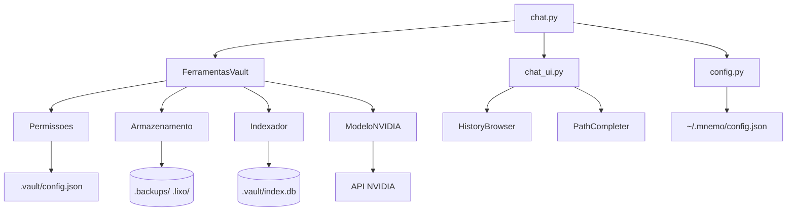

# Arquitetura do MNEMO

## Visão Geral



---

## Camadas

### 1. Interface (chat.py, chat_ui.py)

| Componente | Responsabilidade |
|------------|------------------|
| `chat.py` | Loop principal REPL, tool-calling, gerenciamento de histórico de mensagens, handlers de comandos (`/historico`, `/status`, `/vault`, etc.) |
| `chat_ui.py` | Renderização Rich (painéis, tabelas, spinners), TUI interativa (`HistoryBrowser`), autocomplete contextual (`PathCompleter`), export/import de histórico |

**Fluxo:**
1. Usuário digita mensagem → `chat_ui.py` captura via `prompt_toolkit`
2. `chat.py` adiciona ao histórico de mensagens
3. Envia para `ClienteNVIDIA.conversar()` com ferramentas disponíveis
4. Modelo responde → se `tool_calls`, executa via `FerramentasVault.executar()`
5. Resultado volta para o modelo → resposta final → exibe via `chat_ui.py`

---

### 2. Orquestração (ferramentas.py)

```python
class FerramentasVault:
    def __init__(self, permissoes: Permissoes, armazenamento: Armazenamento, indexador: Indexador):
        ...
    
    def executar(self, nome: str, args: dict) -> dict:
        # Dispatch para método correspondente
    
    def get_tool_definitions(self) -> List[dict]:
        # Schemas OpenAI para o modelo
```

**Ferramentas disponíveis:**
| Ferramenta | Descrição |
|------------|-----------|
| `search` | Busca full-text no índice FTS5 |
| `read_note` | Lê nota Markdown |
| `create_note` | Cria nova nota |
| `append_to_note` | Anexa conteúdo a nota existente |
| `list_files` | Lista arquivos em pasta permitida |

---

### 3. Core (mnemo/)

#### Permissoes (`permissoes.py`)
- Whitelist de pastas permitidas (`pastas_permitidas` no config)
- Modo "todas as pastas" (`todas_as_pastas: true`)
- **Proteção contra path traversal**: `resolve()` + verificação `is_relative_to()`
- `raizes_permitidas()` → retorna `Path` absolutos das pastas base

#### Armazenamento (`armazenamento.py`)
- CRUD atômico: escreve em temp + `rename()` (POSIX atomic)
- **Backups automáticos**: `.backups/{pasta}/{arquivo}.{timestamp}.bak`
- **Lixeira**: `.lixo/{pasta}/{arquivo}.{timestamp}.md` (delete move, não remove)
- `listar(pasta)`, `ler(caminho)`, `escrever(caminho, conteudo)`, `apagar(caminho)`, `existe(caminho)`

#### Indexador (`indexador.py`)
- **SQLite FTS5** virtual table `notas_fts(caminho, conteudo)`
- Tokenizer `porter` + `remove_diacritics` customizado
- `reindexar_tudo()` → varre vault, indexa todos `.md`
- `indexar(arquivo)`, `remover(arquivo)`, `buscar(termo, limite)`
- Busca prefixo: `termo*` (FTS5 nativo)

#### Modelo NVIDIA (`modelo_nvidia.py`)
- Cliente HTTP **OpenAI-compatível** (`/chat/completions`)
- **Streaming**: `stream=True` → `Generator[dict, None, None]` (SSE parsing)
- **Non-streaming**: `stream=False` → `dict` único
- Ferramentas: passa `tools` + `tool_choice="auto"` no payload
- Retry automático (3x) com backoff exponencial em 429/5xx

---

### 4. Configuração (config.py)

```python
@dataclass
class Config:
    vault: str                    # Caminho do vault ativo
    modelo: str                   # ID do modelo NVIDIA
    tema: Literal["auto","dark","light"]
    ultimas_pastas: List[str]     # MRU para autocomplete
    # Persiste em ~/.mnemo/config.json
```

**Validação na inicialização (`Config.validate()`):**
- Vault existe e tem `.vault/config.json`
- Pasta `notas/` existe
- Pelo menos uma pasta permitida
- `NVIDIA_API_KEY` no ambiente

---

### 5. Histórico (chat_ui.py → HistoryBrowser)

```
notas/historico/
├── 2026-09-27_14-30.md    # Checkpoint salvo (/salvar ou auto-save)
├── 2026-09-27_15-15.md
└── ...
```

**Formato do arquivo:**
```markdown
# Sessão 2026-09-27 14:30

## Configuração
- Vault: /path/to/vault
- Modelo: nvidia/nemotron-3-super-120b-a12b

## Conversa
**User:** mensagem
**Assistant:** resposta
...
```

**Funcionalidades:**
- TUI navegável (setas, Enter, q/Esc)
- Filtros: `--since`, `--until`, `--model`
- Busca textual: `/historico search <termo>`
- Carregar sessão: `/historico load <id>` (restaura mensagens + vault + modelo)
- Export JSON: `/historico export backup.json`
- Import JSON: `/historico import backup.json` (pula duplicados por hash)

---

### 6. Autocomplete (PathCompleter)

```python
class PathCompleter(Completer):
    def __init__(self, vault_root: str, base_commands: List[str]):
        self.perms = Permissoes(vault_root)
    
    def get_completions(self, document, event):
        # Detecta comandos: create_note, read_note, append_to_note, list_files
        # Completa pastas permitidas (raiz)
        # Completa arquivos .md dentro de pasta (após "/")
```

**Exemplos:**
```
create_note projetos/     → [projetos/orcamento.md, projetos/plano.md]
read_note estudo/         → [estudo/python.md, estudo/algoritmos.md]
list_files projetos       → [projetos/]
```

---

## Fluxo de Dados Completo

```
┌─────────────┐     ┌──────────────┐     ┌─────────────────┐
│   Usuário   │────▶│  chat_ui.py  │────▶│    chat.py      │
│  (terminal) │     │  (prompt_toolkit) │  │  (loop principal) │
└─────────────┘     └──────────────┘     └────────┬────────┘
                                                  │
                    ┌─────────────────────────────┼─────────────────────────────┐
                    ▼                             ▼                             ▼
            ┌───────────────┐            ┌─────────────────┐           ┌───────────────┐
            │  ClienteNVIDIA │            │ FerramentasVault │           │  HistoryBrowser │
            │  (HTTP + SSE)  │            │  (5 ferramentas) │           │  (TUI histórico) │
            └───────┬───────┘            └────────┬────────┘           └───────┬───────┘
                    │                             │                             │
                    ▼                             ▼                             ▼
            ┌───────────────┐            ┌─────────────────┐           ┌───────────────┐
            │  API NVIDIA   │            │ Permissoes      │           │ notas/historico/│
            │  (Nemotron)   │            │ Armazenamento   │           │  (arquivos .md) │
            └───────────────┘            │ Indexador       │           └───────────────┘
                                         │ (SQLite FTS5)   │
                                         └─────────────────┘
```

---

## Decisões de Design

| Decisão | Justificativa |
|---------|---------------|
| **SQLite FTS5** | Zero-dependência, busca full-text nativa, prefixo, ranking BM25 |
| **Arquivos .md no FS** | Portável, versionável com git, legível sem ferramentas |
| **Whitelist de pastas** | Segurança: impede path traversal, escopo controlado |
| **Backups + Lixeira** | Recuperação acidental, auditoria, sem perda de dados |
| **OpenAI-compatível** | Ecossistema amplo, troca de provedor trivial |
| **Config em ~/.mnemo/** | Padrão XDG, isolado do vault, portável entre máquinas |
| **Histórico em .md** | Legível, grep-ável, versionável, sem DB extra |
| **prompt_toolkit** | Autocomplete, key-bindings, histórico de linha, cross-platform |

---

## Extensibilidade Futura

### Múltiplos Vaults
```
config.json:
{
  "vaults": {
    "pessoal": "/home/user/vault-pessoal",
    "trabalho": "/home/user/vault-trabalho"
  },
  "vault_atual": "pessoal"
}
```
Comandos: `/vault list`, `/vault switch pessoal`, `/vault add nome /path`

### Busca Semântica (RAG)
- `mnemo/embeddings.py` → sentence-transformers local ou API
- Vector store: FAISS (local) ou Chroma
- Nova ferramenta: `semantic_search(query, k=5)`

### Backup/Restore
- `mnemo backup --output backup.tar.gz` (vault + índice + config + histórico)
- `mnemo restore backup.tar.gz --target /novo/vault`

### Plugins
- Sistema de hooks: `pre_write`, `post_index`, `pre_tool_call`
- Descoberta via entry-points `mnemo.plugins`